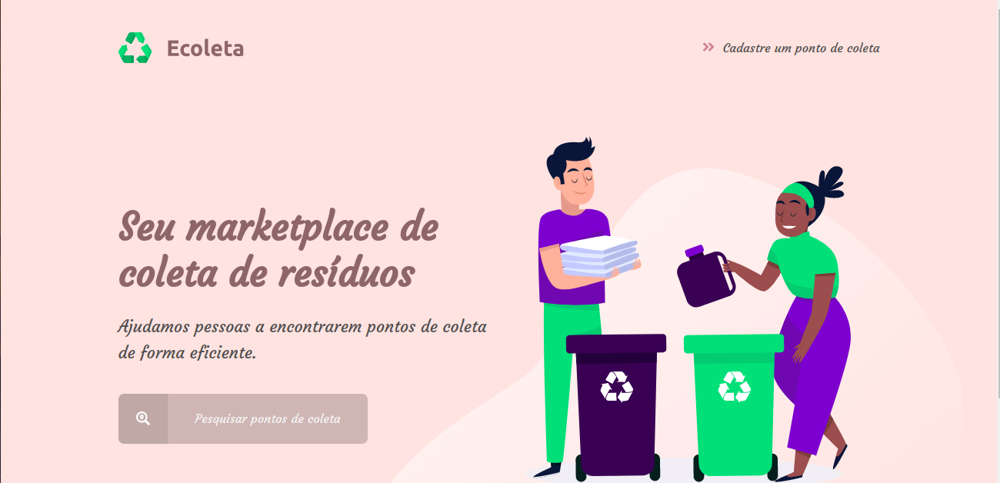

<h1 align="center">
Next Level Week - Starter  

</h1>

## :rocket: Sobre

O NLW é uma semana prática com muito código, desafios, networking e um único objetivo: nos levar para o próximo nível.

Através do método de ensino da Rocketseat, é possível aprender novas ferramentas, conhecer novas tecnologias e descobrir hacks que podem impulsionar a sua carreira.

## :recycle: Projeto Ecoleta :revolving_hearts:

O Ecoleta é um projeto criado para gerenciar o processo de coleta de lixo nas cidades. Com ele, é possível ajudar pessoas a encontrarem pontos de coleta de uma forma mais eficiente.

## :bookmark: Tecnologias Utilizadas

O projeto foi desenvolvido utilizando as seguintes tecnologias

- HTML
- CSS
- JavaScript
- Node.JS

## :heavy_check_mark: Como utilizar

1. Clonar ou fazer download do repositório
2. Instalar dependências <strong>(npm install)</strong>
3. Rodar aplicação <strong>(npm start)</strong>

## :tada: Aproveite!
